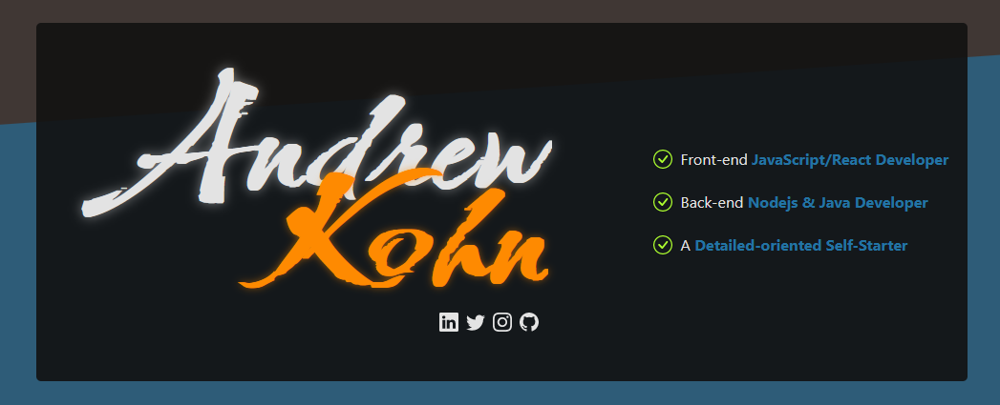

<h1 align="center">apk-portfolio</h1>

<h3 align="center">Andrew Kohn</h3>



<div align="center">
  <a href="https://kohnandrew.com/" target="_blank">Portfolio Link</a>
</div>

#

<h2 align="center">Technology Used</h2>

<div align="center">
   
  &nbsp;
   
  &nbsp;
   
  &nbsp;
   
  &nbsp;
   
  &nbsp;
   
  &nbsp;
   
  &nbsp;
   
  &nbsp;
</div>


#

Current updated version will be in the Master branch. The previous version can be visited by viewing its branch or clicking <a href="https://github.com/AndrewKohn/apk-portfolio/tree/portfolio-v2">here</a>.

#

<h2 align="center">Commands</h2>

Installation

```
npm install
```

Production

```
npm run dev
npm run build
```

Testing

```
npm run test
npm run coverage
```

#
